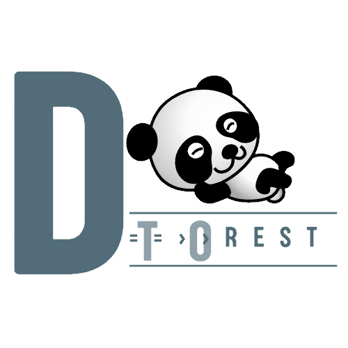

## django-to-rest


Django To Rest is small tool that helps to expose REST api(s) for
django models with minimum effort. Some of the features are:

* Just add a decorator atop of a model and REST apis is created. That's the work!!!
* Options like filtering and ordering are avilable by default for model fields
* Easy customizations via the decorator itself
* *Summary:* Less time??? Just install the tool and the decorator. Done!!!

* * *
* *Documentation:* [https://anp-scp.github.io/django-to-rest](https://anp-scp.github.io/django-to-rest)
* *Source Code:* [https://github.com/anp-scp/django-to-rest](https://github.com/anp-scp/django-to-rest)
* * *

## **Requirements**

Django to Rest need following requirements :

* Python 3.8+
* Django 4.0.5
* djangorestframework 3.13.1
* django-filter 22.1

* * *

## **Installation**

Following are the current installation steps

* Download the build `django-to-rest-0.1.tar.gz`
* Go to the directory where the build is located
* Command: `python3 -m pip install django-to-rest-0.1.tar.gz`
* Above command will install all dependencies (except Python itself)

## **Example**

Let us have a look on an example of how the tool can be used to expose REST API.

Make sure that `djangorestframework` is installed and included in `INSTALLED_APPS ` settings.py as shown below:
```py title="settings.py" linenums="1"
...
INSTALLED_APPS = [
    'rest_framework',
    ...
]
...
```
Now create two models as shown below:
```py title="models.py" linenums="1"
from django.db import models
from django.utils import timezone
from django.contrib import admin
from to_rest.decorators import restifyModel # Import the decorator from the library

# Create your models here.
@restifyModel # Note the way decorator is used
class Question(models.Model):
    question_text = models.CharField(max_length=200)
    pub_date = models.DateTimeField('date published')

    def __str__(self):
        return self.question_text


@restifyModel # Note the way decorator is used
class Choice(models.Model):
    question = models.ForeignKey(Question, on_delete=models.CASCADE,related_name='choices')
    choice_text = models.CharField(max_length=200)
    votes = models.IntegerField(default=0)

    def __str__(self):
        return self.choice_text
```

Note the use of the decorators. We just need to use the decorator and all the views and serializers would be created during startup. But apart from from that, we need one more line to add in `urls.py` of the project (not any app) as shown below:
```py title="urls.py" linenums="1"
from to_rest import utils

urlpatterns = [
        ...
        ]
urlpatterns.extend(utils.restifyApp('rest/v1')) # call this method to add the urls in url patterns. Here the parameter 'rest/v1' is the prefix to be used in the url.
```

That's all. Now start the server. And check the dev url `http://127.0.0.1:8000/`. Below is an example with httpie:

    $ http --json http://127.0.0.1:8000/
    HTTP/1.1 200 OK
    Allow: GET, HEAD, OPTIONS
    Content-Length: 356
    Content-Type: application/json
    Cross-Origin-Opener-Policy: same-origin
    Date: Thu, 07 Jul 2022 15:15:22 GMT
    Referrer-Policy: same-origin
    Server: WSGIServer/0.2 CPython/3.8.10
    Vary: Accept, Cookie
    X-Content-Type-Options: nosniff
    X-Frame-Options: DENY

    {
        "rest/v1/polls/choice": "http://127.0.0.1:8000/rest/v1/polls/choice/",
        "rest/v1/polls/question": "http://127.0.0.1:8000/rest/v1/polls/question/"
    }

## **Quickstart**

The quick start guide is a shor tutorial which i sthe fastes way to get everything setup and get
an overview of the tool.

## **Contribution**

Check the contribution guidelines to know about how to contribute to the project.
